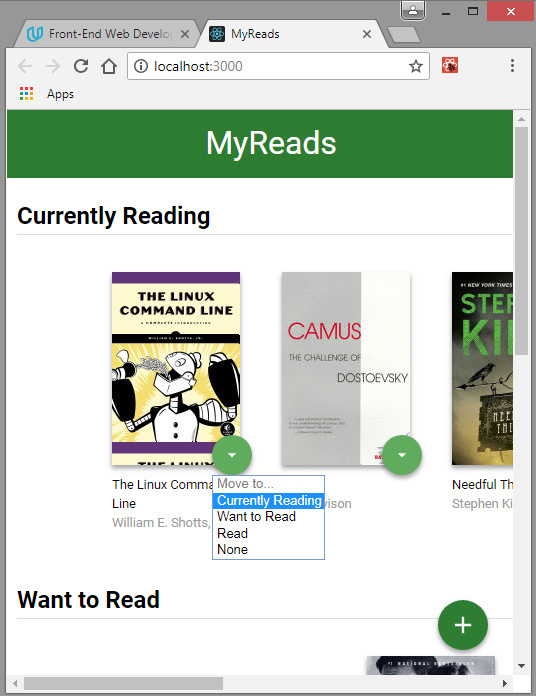

# MyReads: A book tracking app


In this project, I created a web application that allow the user to select and categorize books by three criteria:
- currently reading
- want to read
- read

## App Functionality
In this application, the main page displays a list of "shelves" (i.e. categories), each of which contains a number of books. The three shelves title are:
- **Currently Reading**
- **Want to Read**
- **Read**


Each book has a control that lets user select the shelf for that book. When you select a different shelf, the book moves there. The default value for the control is always the current shelf the book is in.




The main page also has a link to **/search**, a search page that allows user to find books to add to them library.
The search page has a text input that may be used to find books. As the value of the text input changes, the books that match that query are displayed on the page, along with a control that lets user add the book to the library. 


When a book is on a bookshelf, it have the same state on both the main application page and the search page.
The search page also has a link to **/ (the root URL)**, which leads back to the main page.
When the user navigate back to the main page from the search page, there are displayed all of the selections he made on the search page.

## Backend Server

To simplify the development process, the starter code provided a backend server  to develop against. The provided file [`BooksAPI.js`](src/BooksAPI.js) contains the methods to perform necessary operations on the backend:

* [`getAll`](#getall)
* [`update`](#update)
* [`search`](#search)

## Instalation guide
In order to run properly and serve up the site files on your local computer, this app should run on a web server. As a result, it requires
```npm install``` and  ```npm start``` which will start the app in the default browser at: localhost:3000.


Project developed as a part of [Udacity Front-End Developer Nanodegree Program](https://udacity.com/course/front-end-web-developer-nanodegree--nd001)